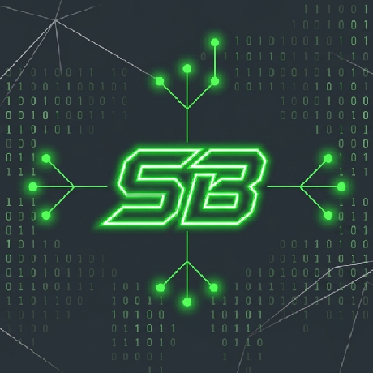

<div align="center">

  

  # Subharup Biswas — Developer Portfolio

  **Full-Stack Engineer · Cybersecurity Researcher · Systems Developer**

  [](https://subharup.com)
  [](https://nextjs.org/)
  [](https://react.dev/)
  [](https://www.typescriptlang.org/)
  [](https://tailwindcss.com/)
  [](https://pages.cloudflare.com/)

  ---

  ### 🌐 [Explore Live Site — subharup.com](https://subharup.com)

  ---

</div>

<div align="center">

## 📖 Overview

A high-performance, edge-rendered personal engineering portfolio and credentials vault built with Next.js 16 App Router, React 19, TypeScript, Framer Motion, and Tailwind CSS v4. Features verified Cisco Networking Academy certifications, Credly badge integrations, interactive case studies, and responsive Light/Dark theme switching.

</div>

---

<div align="center">

## ✨ Core Features

| Feature | Description |
| :--- | :--- |
| **🚀 Edge Prerendering** | 100% static output optimized for Cloudflare Pages edge network delivery. |
| **💎 Light Blue / Sapphire Theme** | High-contrast WCAG-compliant design system with automatic light/dark mode adaptation. |
| **📜 Credentials Vault** | 11 verified accreditations from Cisco, IBM, Skill India, and Coursera with direct Credly links. |
| **🔍 Interactive Document Viewer** | Instant modal previews for PDF and PNG certificates without leaving the page. |
| **💻 Technical Case Studies** | Comprehensive architecture breakdowns for AI engines, subnet tools, and telemetry systems. |
| **📱 Mobile Protection** | Fluid responsive typography, touch-friendly 44px targets, and overflow wrap protection. |

</div>

---

<div align="center">

## 🗺️ Page Architecture

| Route | Description |
| :--- | :--- |
| [`/`](https://subharup.com/) | Hero overview, dynamic bento stats, and technical experience summary |
| [`/skills`](https://subharup.com/skills) | Categorized matrix covering full-stack, security, cloud, and systems tools |
| [`/projects`](https://subharup.com/projects) | Showcase of engineering projects with category filters and search |
| [`/projects/[id]`](https://subharup.com/projects/rupeecheck-ai) | In-depth case studies with problem statements, architecture, and metrics |
| [`/certificates`](https://subharup.com/certificates) | Verified credentials vault with modal document previews and Credly links |
| [`/contact`](https://subharup.com/contact) | Interactive terminal emulator and direct communication channels |

</div>

---

<div align="center">

## 💻 Featured Projects

| Project | Tech Stack | Links |
| :--- | :--- | :--- |
| **RupeeCheck-AI** | React 19, TypeScript, Cloudflare Workers, Edge AI | [Live Demo](https://rupee.subnetmask.tech) • [GitHub](https://github.com/SubharupBiswas/RupeeCheck-AI) |
| **CIDR Subnet Calculator** | Next.js 16, React 19, TypeScript, Tailwind v4 | [Live Demo](https://subnetmask.tech) • [GitHub](https://github.com/SubharupBiswas/cidr-subnet-calculator) |
| **pulseping** | Next.js 16, TypeScript, Prisma, Cloudflare Workers | [GitHub](https://github.com/SubharupBiswas/pulseping) |
| **Exam Timer** | JavaScript, HTML5, CSS3, GitHub Pages | [Live Demo](https://subharupbiswas.github.io/Exam-Timer/) • [GitHub](https://github.com/SubharupBiswas/Exam-Timer) |

</div>

---

<div align="center">

## 📜 Verified Accreditations

- **CCNA: Enterprise Networking, Security, & Automation** — Cisco Networking Academy ([Credly](https://www.credly.com/badges/28f90163-2e1c-48b5-aa33-103fb98572fd))
- **CCNA: Switching, Routing, & Wireless Essentials** — Cisco Networking Academy ([Credly](https://www.credly.com/badges/c557c649-95af-49f1-85cd-abaaed9c73e8))
- **CCNA: Introduction to Networks** — Cisco Networking Academy ([Credly](https://www.credly.com/badges/3f2873d6-243c-4cac-9922-f7b4092be6cf))
- **Python Essentials 1 & 2** — OpenEDG Python Institute / Cisco ([Credly](https://www.credly.com/badges/e6fb8d74-993e-4f06-8547-674f2bd70313))
- **Introduction to Modern AI & Apply AI** — Cisco Networking Academy ([Credly](https://www.credly.com/badges/071208ff-8a9f-4a1d-8b26-d60f4e61cbb8))
- **Getting Started with Artificial Intelligence** — IBM SkillsBuild ([Credly](https://www.credly.com/badges/c144c3ab-6498-4b0b-b2b2-8f1b9413897c))
- **Cybersecurity Essentials & Threat Auditing** — Skill India Digital ([Verification](https://courses.skillindiadigital.gov.in/api/custom_api/view_certificate/9af7e3185cb44fc69887435b4f6f1761))
- **GenAI for Social Media Marketing** — Coursera ([Verification](https://coursera.org/share/8a7516cf075f83b495f7254008089695))

</div>

---

<div align="center">

## 🛠️ Local Development

```bash
# 1. Clone the repository
git clone https://github.com/SubharupBiswas/portfolio.git
cd portfolio

# 2. Install dependencies
npm install

# 3. Start local development server
npm run dev

# 4. Build static export for production
npm run build
```

</div>

---

<div align="center">

## ☁️ Deployment

Configured for **Cloudflare Pages** static hosting:
- Build Command: `npm run build`
- Build Output Directory: `out`
- Dynamic Routes: Handled via Next.js `generateStaticParams()` prerendering.

---

### © 2026 Subharup Biswas. Distributed under the [MIT License](LICENSE).

</div>
